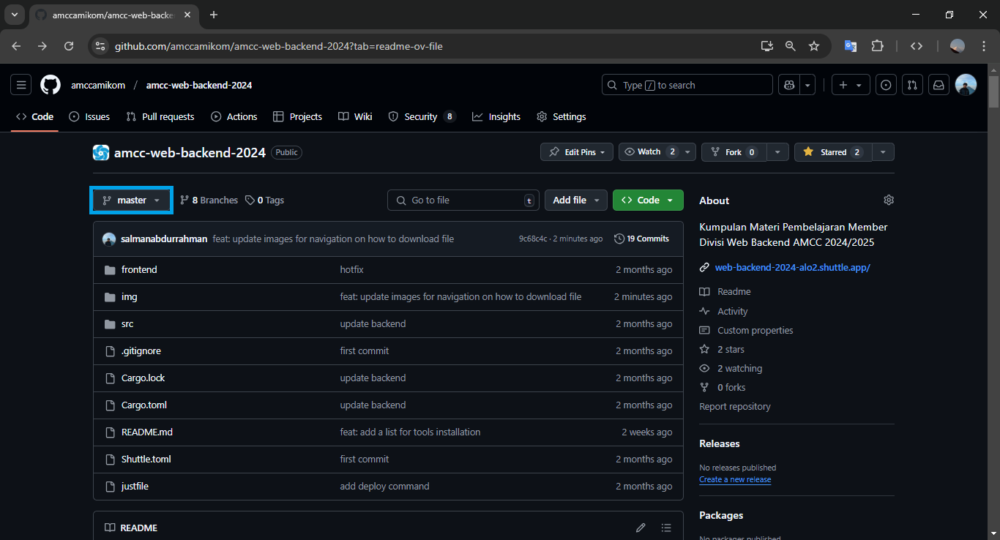
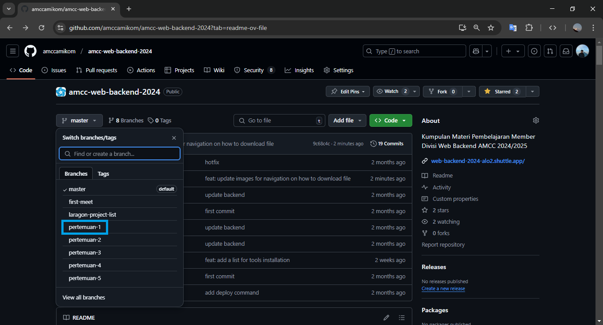
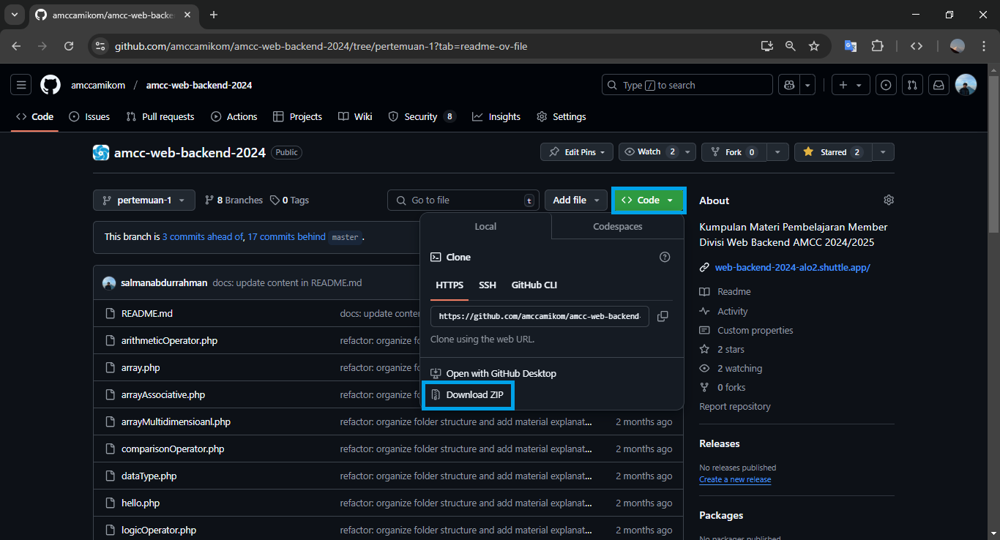
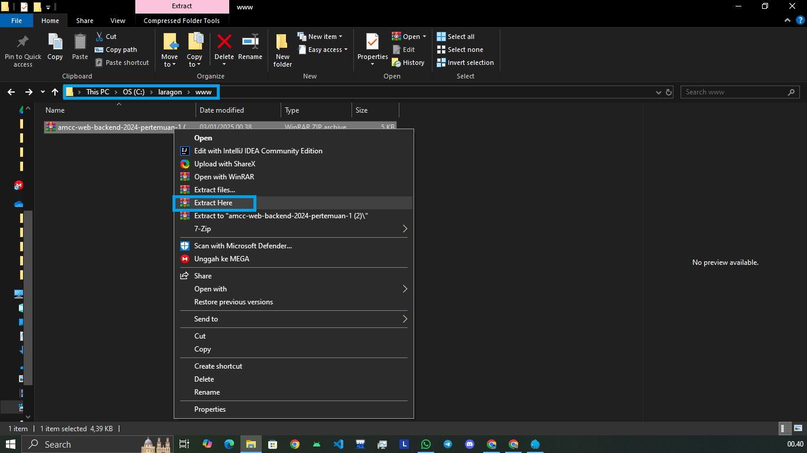
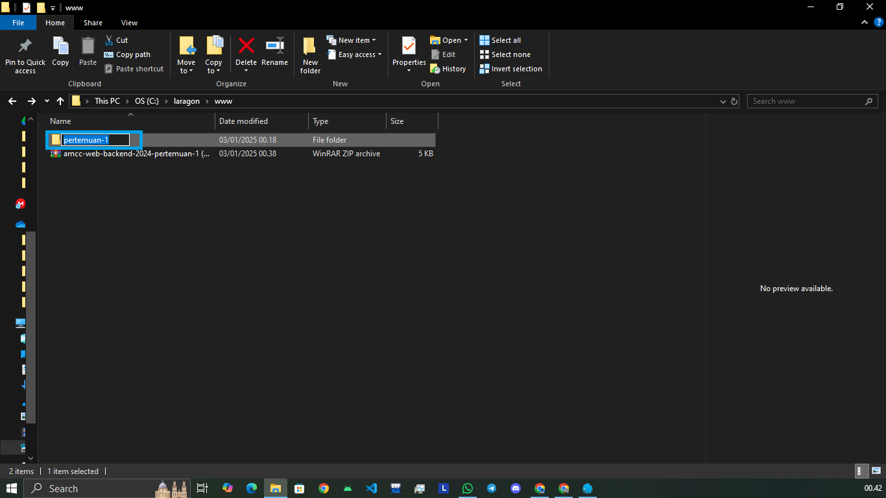
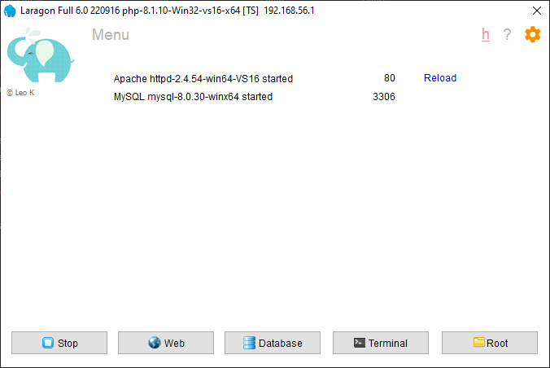
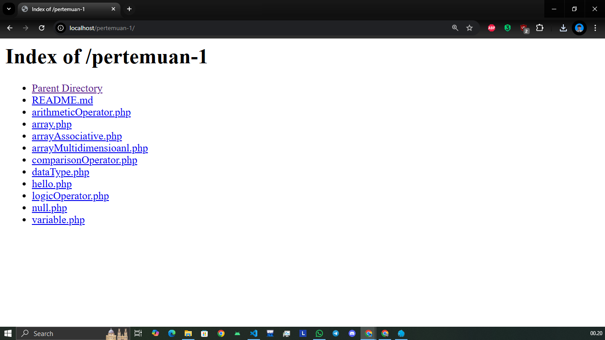
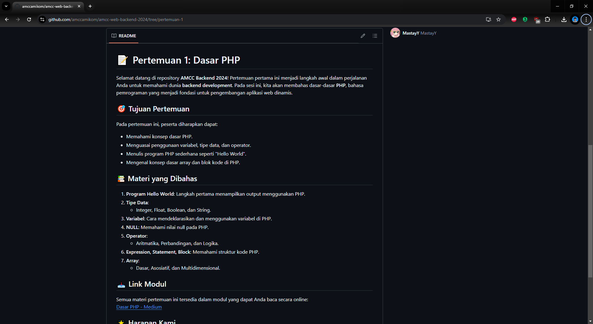

# Materi Web Backend 2025

Selamat datang di repository **Materi Web Backend 2025**. Repository ini dirancang untuk membantu teman-teman untuk mengejar materi yang tertinggal atau meninjau ulang pembelajaran dari pertemuan sebelumnya. Semua file dan materi disusun berdasarkan pertemuan untuk mempermudah navigasi.

<div align="center">
  <picture>
    <source media="(prefers-color-scheme: dark)" srcset="https://media1.tenor.com/m/prtZlWqXstkAAAAd/gaming-vibes.gif">
    
  </picture>
</div>

> **Catatan**: Pilih branch sesuai dengan pertemuan yang teman-teman butuhkan sebelum mengunduh materi.

## Hal yang Akan Dipelajari

   

## 📖 Daftar Isi

-   [🛠️ Instalasi Tools](https://github.com/amccamikom/amcc-web-backend-2024/tree/first-meet?tab=readme-ov-file)
-   [📚 Cara Mengunduh Materi](#-cara-mengunduh-materi)
-   [🚀 Cara Menjalankan File](#-cara-menjalankan-file)
-   [🗂️ Daftar Materi Berdasarkan Pertemuan](#%EF%B8%8F-daftar-materi-berdasarkan-pertemuan)

## 📚 Cara Mengunduh Materi

Ikuti langkah-langkah berikut untuk mengunduh materi dari repository ini dalam format ZIP:

#### 1. Pilih Branch yang Sesuai

-   Klik menu **"Branch"** di halaman utama repository.
-   Pilih branch yang sesuai dengan pertemuan yang dibutuhkan (contoh: `pertemuan-1`, `pertemuan-2`, dst).



#### 2. Cari Folder Materi

Navigasikan ke folder atau file yang sesuai dengan materi yang ingin diunduh.



#### 3. Unduh File ZIP

-   Klik tombol **"Code"** di kanan atas repository.
-   Pilih opsi **"Download ZIP"**.



#### 4. Ekstrak File ZIP

Setelah unduhan selesai, ekstrak file ZIP di komputer teman-teman untuk mengakses semua file materi.

## 🚀 Cara Menjalankan File

Setelah mengunduh dan mengekstrak materi dari repository, ikuti langkah-langkah berikut untuk menjalankan file di sistem lokal menggunakan **Laragon**:

#### 1. Ekstrak File ZIP ke Folder `www` Laragon

-   Setelah file ZIP berhasil diunduh, ekstrak file tersebut.
-   Tempatkan hasil ekstrak di dalam folder `www` pada direktori Laragon di komputer teman-teman.
-   Contoh lokasi folder:
    -   **Windows**: `C:\laragon\www`
    -   **Linux/Mac**: (sesuaikan lokasi folder instalasi Laragon teman-teman).



#### 2. Ubah Nama Folder Hasil Ekstrak

-   Untuk mempermudah akses di browser, ubah nama folder hasil ekstrak.
-   **Contoh**:
    -   Dari: `amcc-web-backend-2024-pertemuan-1`
    -   Menjadi: `pertemuan-1`



#### 3. Jalankan Laragon

-   Buka aplikasi **Laragon**.
-   Klik tombol **Start All** untuk mengaktifkan server.



#### 4. Akses Materi di Browser

-   Buka browser favorit teman-teman (Google Chrome, Firefox, dll.).
-   Ketikkan URL berikut di address bar:

    ```plaintext
    http://localhost/pertemuan-1
    ```

-   **Catatan**: Ganti `pertemuan-1` dengan nama folder yang telah teman-teman buat sesuai materi yang diunduh.



#### 5. Baca Dokumentasi di File `README.md`

-   Setiap materi yang diunduh memiliki file `README.md`.
-   File ini berisi dokumentasi atau panduan singkat mengenai isi repository tersebut, termasuk tujuan materi dan struktur file.



## 🗂️ Daftar Materi Berdasarkan Pertemuan


Semoga repository ini membantu dalam perjalanan belajar teman-teman semuanya! 🎉
